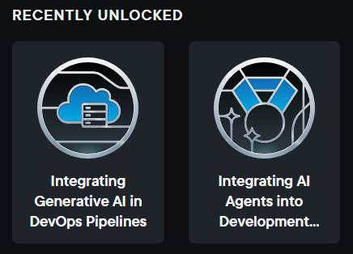
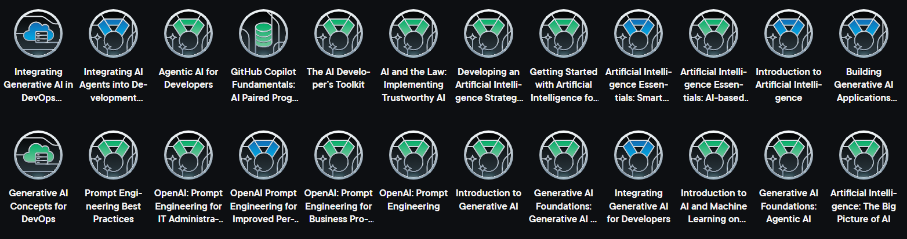

Hi 👋 My name is Inguna Preize
==============================

* 🌍  I'm based in Riga, Latvia  
* 📫  You can contact me at [preizeinguna@gmail.com](mailto:preizeinguna@gmail.com)

---

### A little about me
From early 2020 until the summer of 2021, I embarked on an exciting journey into the world of programming by enrolling in specialized courses at LTPC. These courses provided me with a solid foundation, and upon successful completion, I proudly earned the title of "Programming Technician."  

However, my hunger for knowledge didn't stop there. Eager to explore more, I took the initiative to expand my programming horizons independently. With great determination, I delved into various programming languages and cutting-edge techniques, including HTML, CSS, PHP, JS, and Bootstrap.  

In addition to formal studies, I have successfully completed several **professional certificates on Coursera** and freeCodeCamp, covering **IT Support, Networking, Microsoft Office 365, and Web Development**.  

I actively pursue further learning through platforms like Pluralsight and Credly, earning digital badges and skill achievements along the way.

Continuing to learn and grow in the ever-evolving realm of programming remains my ultimate goal. I am excited to embrace new opportunities and refine my expertise further, contributing to the dynamic world of technology with creativity and innovation.

---

### Skills and Technologies

 

 
 
 

---

### Licenses & Certifications

- [IBM IT Support](https://coursera.org/share/efa9bd3a59c8ee2e6c1374974dec1e98) – IBM (Coursera), Apr 2025  
- [Introduction to Networking](https://coursera.org/share/c425760568437acf1b28cae8e80cf5eb) – NVIDIA (Coursera), Apr 2025  
- [Master Microsoft Office 365 and Power Platform Specialization](https://coursera.org/share/5ae6ace28afb6f588d0882a9fba8cc29) – Microsoft (Coursera), Apr 2025  
- [Google IT Support Specialization](https://coursera.org/share/bcabcbf790f3f005654efb7f63a2475d) – Google (Coursera), Mar 2025  
- [Microsoft IT Support Specialist Specialization](https://coursera.org/share/1eaf82dd14e3a26850675921de097c27) – Microsoft (Coursera), Mar 2025  
- [Responsive Web Design](https://freecodecamp.org/certification/fcc04e86bd1-878c-43f1-98c7-fda52fe50b01/responsive-web-design) – freeCodeCamp, Aug 2023  

---

### Digital Badges

- View all my verified digital badges on [Credly](https://www.credly.com/users/inguna-preize)

---

### Pluralsight Achievements & Badges

I’m an active learner on Pluralsight, constantly exploring new technologies and completing skill paths.

#### Recently Unlocked Badges

 

See all my badges in the [badges folder](https://github.com/preizeinguuna/preizeinguuna/tree/main/badges)

**View all my Pluralsight achievements:**  
[Pluralsight Achievements](https://app.pluralsight.com/achievements)

---

### GitHub Stats

